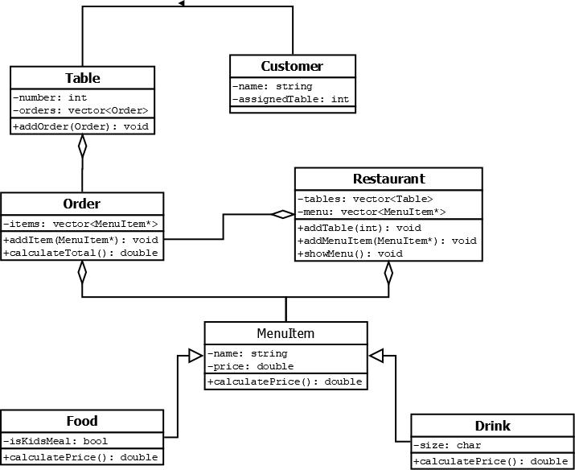

# 🍽️ Sistema de Restaurante — Programación Orientada a Objetos (C++)

Este proyecto implementa un **sistema básico de gestión de restaurante** utilizando conceptos fundamentales de **Programación Orientada a Objetos en C++**, incluyendo:

- Herencia (≥2 clases derivadas)
- Polimorfismo
- Composición (objetos dentro de otros objetos)
- Uso de `vector<>`
- Manejo de punteros a objetos base
- Separación lógica por clases

El programa permite modelar un menú, pedidos, mesas y clientes, demostrando cómo un restaurante puede gestionar distintos tipos de productos del menú a través de polimorfismo.

---

## Objetivos del proyecto

- Aplicar POO a un caso realista.
- Utilizar herencia para representar distintos tipos de elementos del menú.
- Usar polimorfismo mediante un método virtual (`calcularPrecio()`).
- Implementar composición entre clases (Pedidos → Items, Mesas → Pedidos, Restaurante → Mesas).
- Practicar vectores dinámicos de objetos y punteros.
- Crear un sistema modular, escalable y mantenible.

---

## Estructura del Sistema

El sistema modela un restaurante con:

### ✔ **Artículo (clase base)**
Clase abstracta para cualquier ítem del menú.

### ✔ **Alimento, Bebida y Postre (heredan de Articulo)**
Cada uno modifica el cálculo del precio mediante polimorfismo.

### ✔ **Pedido**
Contiene una lista de `Artículo` y calcula el costo total.

### ✔ **Mesa**
Agrupa pedidos por mesa.

### ✔ **Cliente**
Representa un cliente asignado a una mesa.

### ✔ **Restaurante**
Contiene mesas y el menú completo.

---

## Diagrama UML de clases

